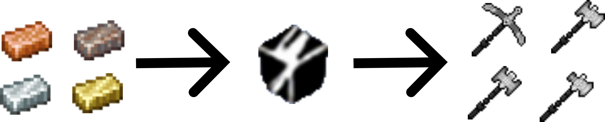
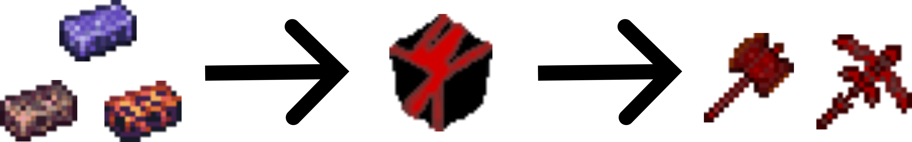
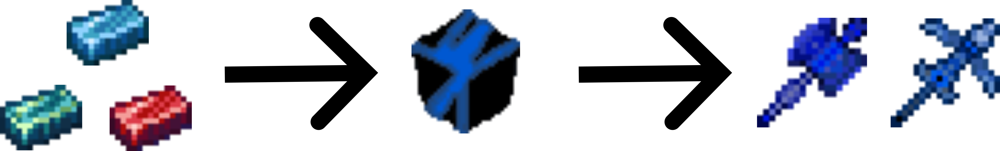
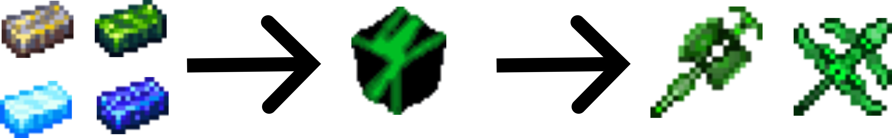
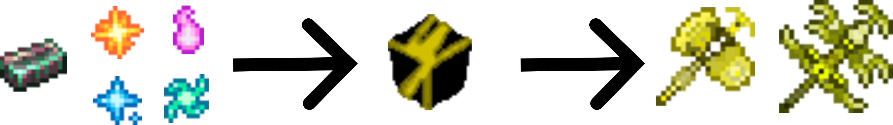
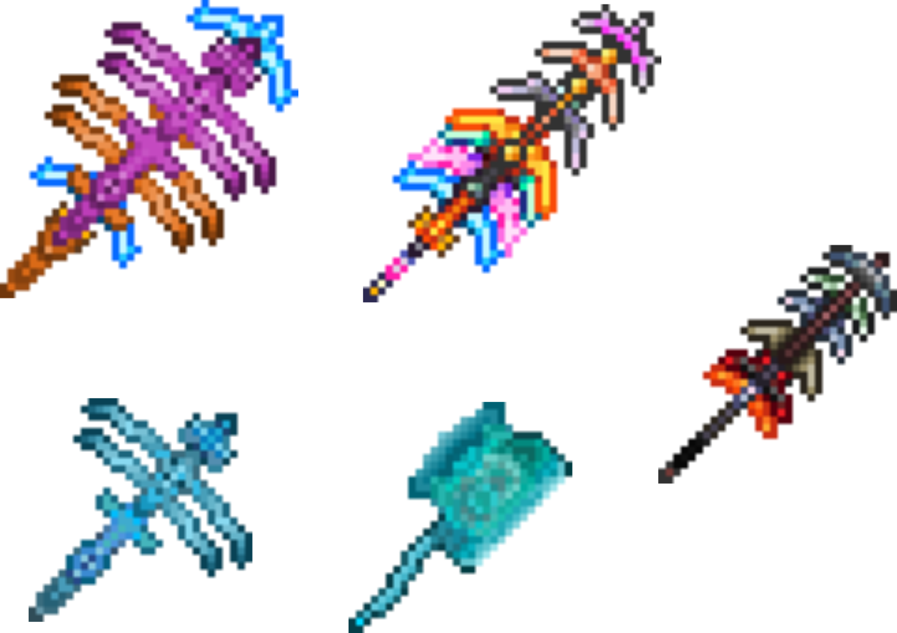

# Intalium

A mod for **Terraria 1.3.5** that introduces new tools for every stage of the game, inspired by the **Patapon** theme.

> ⚠️ **Note:** This mod is no longer available on the Terraria Mod Browser, as it has not yet been ported to **Terraria 1.4.x**.

# Features

* 6 new materials
* 17 new tools
* 1 new enemy

# Showcase

Hard Alloy

Hot Alloy

Awesome Alloy

Great Alloy

Magic Alloy

Miscellaneous

